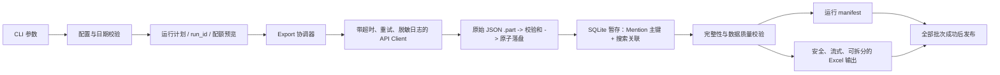

# Meltwater VOC 项目审计与治理方案

> 审计日期：2026-06-04  
> 审计范围：`scripts/`、`config/`、README/TODO、历史 JSON/XLSX 产物、当前本地运行环境  
> 审计方式：代码阅读、离线故障复现、历史数据一致性检查、XLSX 结构检查、官方 API 文档核对  
> 未执行事项：为避免消耗 Meltwater 配额，本次没有调用线上 Export 或 Analytics API

## 1. 结论摘要

当前项目是一个可完成一次性导出的个人脚本，但还不具备可靠、可审计、可重复执行的数据管道所需的保护措施。

建议在完成 P0 止损项之前暂停新的大批量 Export。原因不是代码风格，而是已经确认存在以下结果正确性问题：

1. 多批导出只完成一部分时，脚本仍会生成 Excel 并打印“完成”。
2. 现有 Excel 中有 48 个不同的原始文本值被写成公式；这些值同时出现在分类工作簿和合并工作簿中，共形成 96 个公式单元格并显示为 `#NAME?`。
3. CLI 和文档把 `--end` 表达为包含结束日，但 Meltwater Export 官方语义是“包含开始、不包含结束”；历史“02-20 ~ 05-20”数据主要只到 05-19。
4. 多搜索品类会出现重复计数：现有吸奶器数据跨导出批次有 47 条重复；逐搜索 Analytics 求和相对唯一文档数高出 6,231 次匹配，约 7.1%。

项目当前也没有 Git 仓库、依赖锁、自动化测试、CI、运行清单或数据完整性校验。默认 `python3` 环境没有安装 `openpyxl`，因此按默认方式执行采集会先消耗 Export 配额，最后才在 Excel 阶段失败。

## 2. 当前项目画像

| 项目项 | 当前状态 |
|---|---|
| 代码规模 | 2 个 Python 脚本，共 477 行 |
| 主要入口 | `scripts/collect.py`、`scripts/analytics.py` |
| 配置 | `config/categories.json` |
| 历史数据 | 约 797 MB；223,415 行分类标记数据 |
| 依赖管理 | README 中手工安装 `openpyxl`；无 `pyproject.toml`/lock |
| 测试 | 无；`python3 -m pytest -q` 返回 “no tests ran”，退出码 5 |
| 版本控制 | 当前目录不是 Git 仓库 |
| CI/质量门禁 | 无 |
| 当前 Python | 3.14.5 |
| 当前 `openpyxl` | 未安装 |
| Secret 权限 | `.env` 为 `0644` |
| 数据权限 | JSON/XLSX 为 `0644` |

## 3. 已确认问题

### P0-1：部分批次失败会被静默发布为完整结果

**证据**

- `scripts/collect.py:100-121` 在 600 秒后只返回已完成批次。
- `scripts/collect.py:322-341` 只要任一批次产生数据，就会生成 Excel 并打印“完成”。
- 离线模拟两个批次仅完成一个批次时，脚本仍输出 `CREATE_EXCEL_ROWS 1` 和 `✅ 完成!`。
- Meltwater 官方说明同一时间只处理一个 Export，后续任务保持 `PENDING`；单次任务可能超过半小时。当前 10 分钟全局等待尤其容易让第二批超时。
- `INCOMPLETE`、`CANCELLED` 状态没有被识别，会一直等到超时后被忽略。

**影响**

- 多搜索品类可能生成缺少整个搜索批次的 Excel。
- 文件名、汇总和终端输出仍宣称采集完成，使用者无法识别数据不完整。
- 已消耗的配额无法通过当前脚本恢复或续跑。

**根因**

管道没有显式运行状态机和“全部批次成功才允许发布”的完整性门禁；“有数据”被错误地等同于“完整成功”。

**解决原则**

- 每批顺序创建、等待、下载和入库，避免无意义排队。
- 所有请求都达到 `FINISHED` 且数量校验通过后，才允许生成最终产物。
- 超时应保存可恢复清单并非零退出，不能发布部分 Excel。

### P0-2：Excel 文本被解释为公式，现有产物已损坏

**证据**

- `scripts/collect.py:223-225` 和 `253-255` 将外部文本直接写入单元格。
- 原始数据中有 48 个扁平化文本值以 `=` 开头，其中“命中句子”44 个、“关键词”4 个。
- 历史 Excel 中确认存在 48 个不同的公式化原始值；由于相同数据同时写入分类工作簿和合并工作簿，全部文件合计有 96 个公式单元格：

| 文件 | 公式单元格数 |
|---|---:|
| `Meltwater_VOC_3months_合并.xlsx` | 48 |
| `Meltwater_吸奶器_3months.xlsx` | 25 |
| `Meltwater_暖奶器_3months.xlsx` | 12 |
| `Meltwater_消毒器_3months.xlsx` | 11 |
| **全部工作簿合计** | **96** |

- XLSX 检查显示这些值被计算为 `#NAME?`。

**影响**

- Excel 用户看到的是错误值而不是原始 VOC 内容。
- 外部来源文本可触发公式注入；若出现更危险公式，打开文件可能带来安全风险。

**根因**

输出层没有把不受信任文本当作纯文本处理，也没有“最终工作簿不得包含公式”的验收检查。

**解决原则**

- 对以 `= + - @` 开头或去除前导空白后以这些字符开头的文本进行安全转义。
- Excel 生成后扫描所有单元格，当前业务产物的公式数必须为 0。
- 修复后从原始 JSON 重新生成历史 XLSX。

### P0-3：日期区间契约错误，历史数据与文档标签不一致

**证据**

- `scripts/collect.py:84-85` 将 CLI `--end` 直接转换成当天 `00:00:00Z`。
- Meltwater 官方 FAQ 明确说明 Export 时间窗包含 Start Date，但不包含 End Date。
- 历史请求区间为 `[2026-02-20T00:00:00Z, 2026-05-20T00:00:00Z)`；绝大多数文档最大发布时间为 `2026-05-19`。
- README 示例 `--start 2026-06-01 --end 2026-06-30` 从用户视角表达整月，但实际会排除 6 月 30 日。
- `scripts/analytics.py:85-86,101-123` 在提供自定义起止日期后，仍显示并使用默认 `--days=7`。离线复现 `2026-04-01 ~ 2026-05-01` 显示为“7天”。
- `analytics.py --days 0` 在有数据时稳定触发 `ZeroDivisionError`。
- 单独提供 `--end` 时，开始日期按“当前时间减 days”计算，而不是相对 `--end` 计算，可能形成开始晚于结束的区间。

**影响**

- 月报和日期标签可能漏掉结束日。
- 日均指标错误。
- 非法日期和反向区间可能在消耗配额后才失败。

**根因**

日期只以字符串传递，没有统一的区间模型、边界语义和输入验证。

**解决原则**

- CLI 对用户采用“开始日和结束日都包含”的契约。
- 内部统一转换为 UTC 半开区间 `[start, end_exclusive)`，其中 `end_exclusive = end_inclusive + 1 day`。
- 日数从解析后的区间计算，拒绝非法格式、未来区间、反向区间和 `days <= 0`。

### P0-4：重复文档导致采集行数和 Analytics 指标失真

**证据**

- `scripts/collect.py:322-328` 直接拼接多个批次，没有按 `document.id` 去重。
- 现有吸奶器核心批次和次要批次之间有 47 个相同文档 ID；吸奶器 87,514 行中唯一文档为 87,467。
- 这 47 个重复文档的差异全部在 `matched` 字段，简单保留任一条都会丢失命中搜索信息。
- `scripts/analytics.py:110-119` 将逐搜索 Analytics 结果直接相加。
- 历史吸奶器数据中，唯一文档为 87,467；按各搜索命中次数求和为 93,698，多出 6,231 次，约 7.1%。
- 全部分类标记行共 223,415，全球唯一文档为 218,343；跨品类重复可能是业务需要，但当前没有定义“分类关联行”和“唯一 Mention”的区别。

**影响**

- 品类总量、日均、情感量和下游分析可能被高估。
- 去重若处理不当会丢失搜索匹配、关键词和命中句子。

**根因**

数据模型把 Mention、搜索匹配关系和品类标签压成单行，没有明确主键和关联关系。

**解决原则**

- `document.id` 作为 Mention 主键。
- 命中搜索使用独立关联表或集合并集，跨批重复时合并 `matched.inputs` 和关键词。
- Excel/汇总同时明确给出“唯一 Mention 数”和“搜索命中次数”。
- 多搜索 Analytics 无法求唯一并集时，不再将求和结果标为品类声量。

### P1-1：网络和 API 状态处理不足

**证据**

- 所有 `urlopen` 调用都没有 timeout。
- 没有处理 `URLError`、连接超时、无效 JSON、429 和 503。
- 没有指数退避、重试上限或请求关联 ID。
- Analytics API 错误被静默跳过，最终显示“无数据”，无法区分真实 0 和请求失败。
- `download_export` 信任 API 返回的任意 `data_url`，并向该 URL 转发 API key。

**影响**

- 进程可能永久挂起。
- 短暂网络问题造成失败或不完整结果。
- 错误数据被解释为 0。
- API key 存在被错误转发到非预期主机的风险。

**解决原则**

- 使用可注入、可测试的 HTTP 客户端；设置连接/读取/总超时。
- 只对 429、503 和瞬时网络错误做有上限的退避重试。
- 校验下载 URL 的 HTTPS 和允许主机；日志不得包含 key 或完整敏感响应。

### P1-2：没有幂等、续跑、原子写入和审计清单

**证据**

- 重跑会创建新 Export 并再次消耗配额。
- Excel 目标路径由品类和日期组成，重跑会直接覆盖。
- 下载和 Excel 写入没有 `.part` 临时文件与原子替换。
- 没有记录批次 ID、状态、请求区间、原始数量、唯一数量、重复数量、校验和和输出路径。
- 官方说明 one-time Export 数据 30 天后删除；当前脚本无法恢复超时后已创建的导出。

**影响**

- 中断后只能重跑并再次消耗配额。
- 失败写入可能留下看似正常的损坏文件。
- 无法证明某个 Excel 来自哪些导出和转换版本。

**解决原则**

- 每次运行生成确定性 `run_id` 和 JSON manifest。
- 默认检测同一请求，复用或拒绝重复执行；`--force` 才允许新建。
- 所有下载和输出先写 `.part`，校验后原子替换。

### P1-3：大数据量下的内存和 Excel 上限风险

**证据**

- `download_export` 一次性 `json.loads(resp.read())`。
- 全量 JSON、扁平化行列表和 openpyxl DOM 同时驻留内存。
- 每个单元格都创建样式和边框对象；现有 119,112 行工作簿包含约 560 万个单元格。
- Meltwater 官方支持的单次 Export 数据量可能远高于 Excel 单表 1,048,576 行上限。
- 没有磁盘空间预检、行数拆分或性能预算。

**影响**

- 大批次可能内存耗尽或在 Excel 保存阶段失败。
- 失败发生在已完成昂贵下载之后。

**解决原则**

- 流式下载、流式 JSON 解析、SQLite 暂存去重、openpyxl `write_only` 输出。
- 超过工作表上限时自动拆分并在 manifest 中记录。

### P1-4：字段契约与文档严重漂移

**证据**

- README 宣称“45 列完整字段”。
- 当前脚本实际写 47 列，且列宽只配置到第 45 列，遗漏“讨论串URL”和“父级URL”。
- 4,000 条样本中观察到至少 83 个原始字段路径；Excel 漏掉 `external_id`、`source.id`、`content.links`、`location.geo`、`metrics.estimated_views`、`engagement.quotes/reposts`、`custom.hidden/visible` 等。
- 文档“当前搜索列表（11个）”未包含配置中的奶瓶清洗器搜索；配置实际并集为 12 个搜索。
- `all_search_ids` 是可从 categories 推导的重复配置，存在未来漂移风险。

**影响**

- 使用者错误地把 Excel 当作完整原始数据。
- 新增 API 字段或搜索时没有自动检测。

**解决原则**

- 将原始 JSON 定义为完整事实来源；Excel 明确定义为版本化“精选 VOC 视图”。
- 用单一 schema 定义生成表头、提取逻辑、列宽和字段文档。
- 删除手工维护的 `all_search_ids`，运行时推导并校验。

### P1-5：Secret 和 VOC 数据权限过宽

**证据**

- `.env` 权限为 `0644`。
- 包含作者、主页、地理位置和内容的 JSON/XLSX 权限为 `0644`。
- 当前目录不是 Git 仓库，`.gitignore` 不能提供任何版本控制层保护。
- 没有数据保留、删除、共享或脱敏说明。

**影响**

- 同机其他账号可读取 API key 和 VOC 数据。
- 复制、备份或分享目录时容易带出 secret 和个人数据。

**解决原则**

- 立即轮换 API key，并将 secret/data 权限收紧为用户可读。
- 运行时设置安全 umask。
- 建立数据分级、保留期限、脱敏和删除流程。

### P1-6：情感汇总隐藏未知和缺失值

**证据**

当前历史数据中，下列记录不属于 positive/negative/neutral，但 `print_summary` 不显示：

| 数据集 | unknown/缺失 |
|---|---:|
| 消毒器 | 1,479 |
| 暖奶器 | 12,211 |
| 吸奶器核心 | 5,030 |
| 吸奶器次要 | 15 |

**影响**

- 情感分布看起来不闭合，使用者无法理解缺口。
- Analytics 条形图的白色部分实际上混合了 neutral、unknown 和缺失。

**解决原则**

- 汇总显式显示 positive、negative、neutral、unknown、missing。
- 验收要求各类别数量之和等于总唯一 Mention 数。

## 4. 工程债务

| 债务 | 当前表现 | 建议 |
|---|---|---|
| 无 Git | 无变更历史、无法运行 CodeRabbit diff review | 初始化 Git，首次提交前排除 secret/data |
| 无依赖锁 | 当前环境没有 `openpyxl`，无法复现 | `pyproject.toml` + lock，固定 Python 3.12 |
| 无测试 | 任何日期、去重、状态修复都可能回归 | 单元、集成、契约、产物、性能测试 |
| 脚本耦合 | API、编排、转换、Excel、CLI 混在两个文件 | 拆为可注入、可测试模块，保留兼容入口 |
| 重复逻辑 | env/config/API 调用在两个脚本重复 | 共享配置和 HTTP 客户端 |
| 导入副作用 | 导入 `collect.py` 会创建数据目录 | 目录创建只发生在命令执行阶段 |
| 无 CI | 无 lint、类型、测试、secret scan 门禁 | 本地 `make check` + CI |
| 无可观测性 | 只有 print，无结构化状态或失败原因 | 结构化日志、manifest、退出码 |
| 无运行治理 | 无 dry-run、配额确认、重复请求保护 | 计划预览、显式确认、幂等 run_id |

## 5. 目标架构

关键设计约束：

1. **Fail closed**：任一批次未完成、数量不一致或产物校验失败，整个运行不能发布为成功。
2. **Raw is source of truth**：原始 JSON 是完整事实来源；Excel 是版本化精选视图。
3. **Mention 与命中关系分离**：Mention 按 `document.id` 唯一，搜索和品类是多对多关系。
4. **可恢复**：超时和中断保留 manifest，`--resume RUN_ID` 不创建重复 Export。
5. **可验证**：每次运行都有请求、数量、重复、校验和、输出和 schema 版本。
6. **安全默认**：HTTPS、主机允许列表、无 secret 日志、安全文件权限、公式转义。

## 6. 分阶段治理路线

### 阶段 0：立即止损（0.5-1 天）

1. 暂停新的大批量采集。
2. 轮换 Meltwater API key。
3. 将 `.env`、历史 JSON/XLSX 和数据目录收紧为仅当前用户访问。
4. 给现有 XLSX 标注“存在公式损坏和重复计数，不作为最终分析依据”。
5. 保存历史 JSON 的 SHA-256；JSON 仍可作为修复来源。

退出条件：

- Secret 和数据不再是 `0644`。
- 存量 Excel 的已知错误已被登记。
- 新 Export 必须经过人工确认。

### 阶段 1：正确性与失败保护（3-5 天）

1. 建立测试基线和可复现环境。
2. 统一日期区间模型和验证。
3. 实现 Export 状态机、顺序批次、超时续跑、失败关闭。
4. 实现 Mention 去重及 `matched` 合并。
5. 修复 Excel 公式注入并增加产物扫描。
6. 修复 Analytics 日期和多搜索总量表达。

退出条件：

- P0 回归测试全部通过。
- 任一批次未完成时不会生成最终 Excel，退出码非 0。
- 生成工作簿公式数为 0。
- 吸奶器测试夹具中跨批重复正确合并为一个 Mention。

### 阶段 2：可扩展与可审计（3-5 天）

1. 流式下载、SQLite 暂存、流式 Excel。
2. run manifest、原子写入、校验和、重复运行保护。
3. schema 版本化、字段文档自动生成、数据质量报告。
4. dry-run、配额预览和显式确认。

退出条件：

- 250,000 行脱敏夹具在规定内存和时间预算内完成。
- 中断后可续跑，不新建重复 Export。
- manifest 可追溯到所有输入、批次和输出。

### 阶段 3：工程化与数据治理（2-3 天）

1. Git、CI、lint、类型检查、覆盖率和 secret scan。
2. 数据权限、保留、删除和分享规则。
3. README、运行手册、故障手册和验收清单。
4. 从原始 JSON 重建历史 Excel，并出具修复前后对账报告。

退出条件：

- CI 全绿，测试覆盖关键状态分支。
- 新同事可按 README 在干净环境完成离线测试。
- 存量修复产物通过数量、唯一性、公式和情感闭合校验。

## 7. 测试矩阵

| 层级 | 重点场景 |
|---|---|
| 单元测试 | 日期边界、非法日期、`days <= 0`、配置校验、公式转义、字段提取、状态转换 |
| API 客户端测试 | timeout、429/503 重试、400/403 不重试、非 JSON 错误、日志脱敏、下载 URL 主机校验 |
| 协调器测试 | 全批成功、部分成功、`INCOMPLETE`、`CANCELLED`、超时续跑、重复 run_id |
| 数据测试 | 跨批重复合并、匹配搜索并集、唯一数、情感闭合、原始数与导出 request.count 对账 |
| Excel 测试 | 公式数为 0、表头/schema 一致、列宽覆盖、行数、负面子集、超上限拆分 |
| CLI 集成测试 | `--dry-run`、`--resume`、`--force`、错误退出码、无 key 时帮助/list 可用 |
| 性能测试 | 250k 行转换、内存峰值、磁盘预检、原子文件 |
| 线上验收 | 经人工批准的 1 个搜索、1 天 canary Export；不在 CI 自动执行 |

## 8. 总体验收标准

上线前必须同时满足：

1. `pytest`、lint、类型检查、secret scan 全部通过。
2. 任何未完成批次都使运行失败，且没有最终 XLSX 发布。
3. 日期报告明确显示用户区间和 API 半开区间；结束日数据不会被遗漏。
4. 每个品类输出的唯一 Mention 数与去重后主键数一致。
5. `matched.inputs` 在跨批重复时完整合并。
6. XLSX 中公式单元格数为 0，表头和 schema 版本一致。
7. 情感分类之和等于唯一 Mention 总数。
8. 每个输出都可通过 manifest 追溯到 Export ID、原始文件和 SHA-256。
9. 相同运行请求默认不会创建新的 Export；只有 `--force` 可覆盖保护。
10. `.env` 和本地 VOC 数据仅当前用户可读写。
11. 存量数据已从原始 JSON 重建并完成修复前后对账。

## 9. 本次审计验证记录

| 验证 | 结果 |
|---|---|
| `python3 -m compileall -q scripts` | 通过 |
| `python3 -m pytest -q` | 无测试，退出码 5 |
| 默认运行依赖 | 当前 `openpyxl` 未安装 |
| 跨批重复 | 吸奶器 47 条 |
| 多搜索匹配膨胀 | 93,698 次匹配 vs 87,467 个唯一 Mention |
| 现有 XLSX 公式扫描 | 96 个公式单元格，来自 48 个不同原始值 |
| Secret/数据权限 | `.env` 和历史数据均为 `0644` |
| CodeRabbit | 当前目录非 Git 仓库，且 CLI 未安装，无法运行 |

## 10. 官方参考

- [Meltwater Exporting Mentions](https://developer.meltwater.com/docs/meltwater-api/listening/export-api/)
- [Meltwater API FAQ](https://developer.meltwater.com/docs/meltwater-api/help/faqs/)
- [Meltwater Analyzing Mentions](https://developer.meltwater.com/docs/meltwater-api/listening/generating-analytics/)
