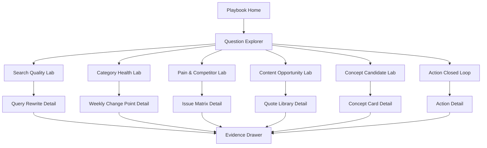

# Playbook Analyst Lab UI/UX Design

版本：2026-06-11  
选择方案：方案 3 - Playbook Analyst Lab  
适用产品：Meltwater VOC closed-loop analytics  
目标用户：分析师、产品经理、内容/营销、CX、业务负责人

---

## 1. Product Positioning

Playbook Analyst Lab 不是传统 BI dashboard，而是一个“从业务问题进入”的洞察工作台。

核心理念：

- 用户不是先找表，而是先选择业务问题。
- 每个问题都对应 playbook 方法、数据门禁、分析卡片、证据样本和推荐动作。
- 系统必须持续提醒用户：Meltwater 声量不是销量，自动 sentiment 不是投诉率，query blocked 不能输出业务结论。
- 任何可采纳结论都要能追踪到 `insight_id -> evidence -> action_id -> owner -> review`。

一句话定位：

> A question-first VOC insight lab that turns Meltwater data into reviewed business decisions.

---

## 2. Experience Principles

### 2.1 Question First

界面首页展示业务问题，而不是数据表：

- 搜索质量是否可信？
- 哪个品类出现异常变化？
- 吸奶器痛点集中在哪些场景？
- 哪些竞品/品牌被一起提及？
- 哪些用户原话可以转成内容 brief？
- 哪些概念候选值得产品验证？
- 哪些洞察已经进入 action 闭环？

### 2.2 Evidence Always Visible

每张 insight card 必须能展开证据：

- hit sentence / evidence text
- occurrence_id / document_id
- URL
- sentiment
- source type
- sample review status

### 2.3 Quality Gate Before Interpretation

所有页面顶部保留 query quality gate：

- `pass`：允许解释为业务信号。
- `review`：可探索，但需要样本复核。
- `blocked_by_query_noise`：只能做数据治理动作，不能输出业务判断。
- `data_quality_alert`：是数据质量风险，不是业务危机。

### 2.4 Decision Traceability

每个被采纳的 insight 都必须能看见：

- `insight_id`
- source mart
- confidence/readiness
- action status
- owner
- due date
- review date
- close reason

---

## 3. Information Architecture



Primary navigation:

1. `Playbook`
2. `Search Quality`
3. `Category Health`
4. `Pain & Competitor`
5. `Content Lab`
6. `Concept Lab`
7. `Action Loop`
8. `Data Quality`

Global utilities:

- Category filter: `吸奶器 / 暖奶器 / 消毒器`
- Time range filter
- Readiness filter
- Owner filter
- Export button
- Evidence drawer

---

## 4. Core Screens

### 4.1 Playbook Home

Purpose：让用户从业务问题进入分析。

Layout：

```text
+---------------------------------------------------------------+
| Meltwater VOC Analyst Lab                    [Date] [Export]  |
+-------------------+-------------------------------------------+
| Quality Gate      | Ask a business question                   |
| - 吸奶器 pass      |                                           |
| - 暖奶器 blocked   |  [Search quality] Is this real demand?    |
| - 消毒器 blocked   |  [Health] Which category is changing?     |
|                   |  [Pain] What issues drive negative VOC?   |
| Action Loop       |  [Content] What user quotes can we reuse? |
| - 57 actions      |  [Concept] What should product test next? |
| - 0 measured      |                                           |
+-------------------+-------------------------------------------+
| Recently Generated Insight Cards                              |
+---------------------------------------------------------------+
```

Top modules:

- Quality Gate Summary
- Action Loop Summary
- Freshness / generated_at
- Top 6 playbook questions
- Recently generated insight cards

Data mapping:

- `mart_search_quality`
- `mart_action_status_summary`
- `fact_insight`
- `mart_manifest.json`

Primary CTA:

- `Start with a question`
- `Review blocked searches`
- `Open action loop`

---

### 4.2 Question Explorer

Purpose：把 playbook 的方法变成可点击的问题目录。

Interaction:

- 点击问题后进入对应 Lab 页面。
- 每个问题卡显示：
  - status
  - recommended audience
  - available data count
  - blocked reason
  - last generated

Example cards:

| Question | Audience | Status | Source |
| --- | --- | --- | --- |
| 暖奶器声量增长是真需求还是噪声？ | Data | blocked | `mart_search_quality` |
| 吸奶器痛点是否集中在漏奶/吸力/续航？ | Product/CX | ready | `mart_product_pain_radar` |
| 哪些用户原话可以转内容 brief？ | Content/Marketing | ready | `mart_platform_content_opportunity` |
| 哪些周度变化值得复盘？ | Business Leads | ready | `mart_category_health_weekly_delta` |

---

### 4.3 Search Quality Lab

Purpose：治理 query 噪声，防止错误业务结论。

Main layout:

```text
+---------------------------------------------------------------+
| Search Quality Lab                                            |
+---------------------------------------------------------------+
| Category | Search | Precision | Noise | Status | CTA          |
| 暖奶器   | Bottle Warmer              | 40.29% | high | blocked |
| 消毒器   | Bottle Sterilizer & Dryer  | 79.52% | med  | blocked |
| 吸奶器   | ...                        | pass   | low  | pass    |
+---------------------------------------------------------------+
| Query Rewrite Recommendation                                  |
| Must include | Suggested excludes | Watch terms | Expected lift |
+---------------------------------------------------------------+
| Query Sample Review Queue                                     |
+---------------------------------------------------------------+
```

Required interactions:

- Open recommendation detail.
- View noise samples.
- Mark query sample verdict:
  - `true_product_match`
  - `noise`
  - `unclear`
- Export query rewrite brief.

Data mapping:

- `mart_search_quality`
- `mart_query_rewrite_recommendation`
- `fact_query_sample_review`
- `query_rewrite_recommendations.md`
- `query_sample_review_queue.csv`

UX guardrail:

- If category is blocked, downstream pages display a visible banner:
  - “This category is query-blocked. Treat all business conclusions as hypotheses only.”

---

### 4.4 Category Health Lab

Purpose：识别品类周度变化点，但不误读为销量。

Main modules:

- Weekly volume trend
- Negative rate trend
- Change point table
- Top source domains
- Top negative domains

Card structure:

```text
[Change Point Card]
Category: 暖奶器
Week: 2026-01-12
Mentions: 14,307
WoW Volume: +56.19%
Negative Rate: 30.83%
WoW Negative: +19.16%
Level: spike
Reason: volume or negative-rate spike versus previous week
Data Quality: blocked_by_query_noise
CTA: Review evidence / Create action
```

Data mapping:

- `mart_category_health_weekly`
- `mart_category_health_weekly_delta`
- `weekly_change_points.md`

UX guardrail:

- Display: “Voice movement only. Do not interpret as sales or market share.”

---

### 4.5 Pain & Competitor Lab

Purpose：把产品痛点拆到渠道、竞品/品牌、情感和行动建议。

Main layout:

```text
+---------------------------------------------------------------+
| Pain & Competitor Lab                                         |
+---------------------------------------------------------------+
| Left: Issue Filters        | Center: Matrix                    |
| - Pain / comfort           | Issue x Channel x Brand           |
| - Suction performance      |                                   |
| - Leak / spill             |                                   |
| - Battery / power          |                                   |
+----------------------------+-----------------------------------+
| Right Drawer: Evidence + Recommended Action                   |
+---------------------------------------------------------------+
```

Matrix columns:

- category
- issue
- channel/source_type
- brand_label
- mentions
- negative_rate
- readiness
- recommended_action

Data mapping:

- `mart_product_pain_radar`
- `mart_issue_channel_competitor_matrix`
- `mart_competitor_battlecard`
- `product_pain_deep_dive.md`
- `competitor_battlecards.md`

Primary actions:

- `Open evidence`
- `Create product backlog item`
- `Create CX macro update`
- `Create competitor objection card`

UX guardrail:

- Low sample cells show `weak_signal`.
- `Unattributed` brand rows are shown separately from named competitors.

---

### 4.6 Content Opportunity Lab

Purpose：将正向用户语言转化为内容 brief 和素材库。

Main modules:

- Content brief queue
- User voice quote library
- Topic/platform filters
- Readiness and quality gates

Brief card:

```text
[Content Brief]
Topic: Noise
Category: 吸奶器
Platform: social network
Positive mentions: 444
Positive rate: 67.89%
Quotes: 10
Readiness: ready_for_review
Suggested angle:
Use Noise user language as PDP proof, FAQ copy, or short-form content.
CTA: Open quote library / Create content brief
```

Quote card:

```text
[User Quote]
Quote text
Source type
Sentiment
URL
Usage type
Review status
```

Data mapping:

- `mart_content_opportunity`
- `mart_platform_content_opportunity`
- `mart_user_voice_quote_library`
- `content_brief_queue.md`
- `user_voice_quote_library.csv`

UX guardrail:

- Quotes are “candidate user language” until reviewed.
- Never publish raw quote externally without manual review.

---

### 4.7 Concept Candidate Lab

Purpose：从痛点和正向偏好中形成产品概念候选。

Concept card sections:

- User problem
- Positive preference
- Negative pain
- Competitor/alternative signal
- Counter-evidence
- Suggested test
- Owner domain
- Evidence samples

Data mapping:

- `mart_concept_candidates`
- `fact_evidence_sample`
- `sample_review_queue.csv`

Primary actions:

- `Create concept test`
- `Send to product review`
- `Attach external feedback`

UX guardrail:

- Concept candidate is not product validation.
- Require external review/support/return data before roadmap decision.

---

### 4.8 Action Closed Loop

Purpose：让所有被采纳的 insight 有 owner、状态、指标和复盘。

Views:

- Board view
- Table view
- Owner summary
- Overdue actions

Statuses:

- `Proposed`
- `Accepted`
- `In Progress`
- `Shipped`
- `Measured`
- `Closed`
- `Rejected`

Data mapping:

- `fact_action_register`
- `mart_action_status_summary`
- `fact_action_feedback_unmatched`
- `action_closed_loop_summary.md`

Primary actions:

- Update owner
- Update status
- Add actual metric
- Close/reject with reason
- Export action feedback CSV

---

## 5. Insight Detail Drawer

The detail drawer is shared across all Labs.

Sections:

1. Header
   - title
   - category
   - readiness
   - confidence score
   - priority score
2. Why this matters
   - business interpretation
   - caution / quality gate
3. Evidence
   - samples
   - URL
   - sentiment
   - source type
4. Lineage
   - source table
   - source key
   - generated_at
5. Recommended action
   - action type
   - owner domain
   - action_id if generated
6. Review trail
   - sample review
   - action feedback
   - close reason

Minimum required fields:

- `insight_id`
- `play_id`
- `category`
- `readiness`
- `source_table`
- `source_key_json`
- `recommended_action_type`
- `owner_domain`

---

## 6. Visual System

### 6.1 Tone

Use a serious analytical SaaS style:

- calm
- evidence-first
- dense but readable
- no consumer-app decoration

### 6.2 Color Semantics

| State | Color Role |
| --- | --- |
| `pass` | green |
| `review` | blue |
| `weak_signal` | gray |
| `blocked_by_query_noise` | purple |
| `data_quality_alert` | amber |
| `red/orange/yellow` crisis | severity colors |
| `Closed` | green |
| `Rejected` | gray |
| `Overdue` | red |

### 6.3 Component Set

Core components:

- Question Card
- Quality Gate Badge
- Insight Card
- Change Point Card
- Matrix Table
- Evidence Drawer
- Quote Card
- Action Status Pill
- Owner Avatar/Domain Tag
- Export Button
- Empty State
- Data Caution Banner

---

## 7. MVP Scope

### MVP 1：Question-First Read-Only Lab

Must include:

- Playbook Home
- Question Explorer
- Search Quality Lab
- Category Health Lab
- Pain & Competitor Lab
- Content Opportunity Lab
- Insight Detail Drawer

Data source:

- static generated files from `data/marts/YYYYMMDD`
- `voc_mart.sqlite`
- Markdown reports as export links

No writeback yet.

Acceptance:

- User can answer 5 playbook questions without opening raw CSV.
- Every insight card links to evidence.
- Blocked categories are visibly gated.

### MVP 2：Review And Action Layer

Add:

- Sample Review Queue
- Query Sample Review Queue
- Action Board
- Action feedback import/export
- Owner/status summary

Acceptance:

- User can move one insight from review to action.
- User can export action feedback CSV.
- System can show closed-loop rate and overdue action count.

### MVP 3：Analyst Workspace

Add:

- Saved filters
- Compare categories
- Create custom playbook question
- Generate report deck/brief
- External feedback alignment

Acceptance:

- Analyst can generate a stakeholder-ready brief from selected insights.
- Product/CX/Marketing can each receive domain-specific action views.

---

## 8. Frontend Data Contract

Initial frontend can read directly from SQLite-backed API or materialized JSON endpoints.

Recommended endpoint shape:

```text
GET /api/manifest
GET /api/playbook/questions
GET /api/search-quality
GET /api/category-health/change-points
GET /api/pain/matrix
GET /api/content/briefs
GET /api/quotes
GET /api/insights
GET /api/insights/:id
GET /api/actions
GET /api/actions/summary
```

Suggested response rule:

- every row includes `source_table`
- every card includes `readiness`
- every detail view can load evidence samples
- every action can trace back to `insight_id`

---

## 9. Navigation And Empty States

Empty states should teach the playbook:

- No content brief:
  - “No ready content opportunity. Check query quality or widen topic filters.”
- Query blocked:
  - “This category is blocked by query noise. Start with query rewrite recommendations.”
- No closed actions:
  - “No measured actions yet. Import action feedback to close the loop.”
- No quotes:
  - “No candidate quotes. Use positive content opportunity filters or review evidence samples.”

---

## 10. Recommended Implementation Order

1. Build static frontend shell with navigation and filters.
2. Implement `/api/manifest` and `/api/search-quality`.
3. Implement Playbook Home and Question Explorer.
4. Implement Search Quality Lab.
5. Implement Category Health Lab.
6. Implement Pain & Competitor Lab.
7. Implement Content Opportunity Lab.
8. Implement Insight Detail Drawer.
9. Add Action Closed Loop.
10. Add review/writeback flow.

---

## 11. Product Success Metrics

Usage:

- Weekly active analysts
- Questions opened per session
- Insight detail drawer open rate
- Evidence sample review rate

Decision quality:

- % insights with evidence opened
- % actions with owner
- % actions closed or rejected with reason
- % query-blocked conclusions prevented

Business workflow:

- content briefs created
- product backlog items created
- CX macros updated
- query rewrites completed

---

## 12. Design Decision

Chosen direction:

> Playbook Analyst Lab should be the primary product experience.

Reason:

- It matches the current project’s real strength: playbook-driven business questions.
- It uses the mart layer already implemented.
- It avoids the trap of a generic dashboard.
- It keeps evidence, quality gates, and action loop visible in one workflow.

Recommended next design artifact:

- Low-fidelity wireframes for the 6 MVP screens.
- Then convert to frontend component backlog.
