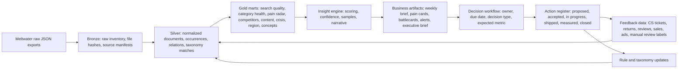

# Meltwater VOC Playbook-Backwards E2E Closed-Loop Automation Plan

版本：2026-06-11  
起点文档：`docs/playbooks/meltwater-voc-business-insights-playbook.md`  
适用数据包：`data/excel_complete_20260611/`  
核心目标：以 playbook 的业务答案为终局，反向规划并落地 `数据ETL -> 数据建模 -> 洞察框架 -> 业务结论 -> 指导决策 -> 动作闭环 -> 复盘反馈` 的端到端自动化系统。

---

## Execution Log

- 2026-06-11: P0 已执行。本次新增 `config/insights/` 业务语义配置、`src/meltwater_excel/taxonomy.py`、`src/meltwater_excel/marts.py`、CLI `build-marts`、Makefile `insights` 目标、`scripts/run_ruff_stdin.py`、P0 自动化测试和 `docs/runbooks/voc-insight-automation.md`。已生成全量产物 `data/marts/20260611/`：`voc_mart.sqlite`、`search_precision_report.md`、`pain_point_cards.md/csv`、`weekly_voc_brief.md`、`action_register.csv`。验证结果：`make quality` 通过；`mart_manifest.json` PASS，包含 `mart_search_quality=9`、`mart_product_pain_radar=21`、`mart_category_health_weekly=56`、`fact_action_register=8`。业务门禁：暖奶器和消毒器被 query quality gate 标记为 `blocked_by_query_noise`，吸奶器痛点雷达可进入行动复核。

---

## 1. 总体判断

当前项目已经完成了“原始 JSON 到完整 Excel 数据包”的基础数据产品化，且补采缺口已被记录、执行和纳入新版数据包。下一阶段不应该继续只做表格导出，而应把 playbook 升级为可运行的数据洞察产品。

新的工作方式是：

1. 先定义业务最终要得到的答案，例如“吸奶器 Top 痛点是什么、谁负责、两周后如何复盘”。
2. 再反推需要什么指标、样本、规则、口径和数据表。
3. 最后把这些规则写成可重复运行的 ETL、mart、报告和 action register。

当前最关键的工程选择：

- `document_id` 用于唯一内容分析。
- `occurrence_id` 用于来源、搜索命中、曝光触点和样本追踪。
- `insight_id` 用于洞察版本化。
- `action_id` 用于业务闭环追踪。

当前最关键的数据风险：

- 暖奶器 query 噪声会污染品类健康、危机预警和负面率结论。
- Meltwater 当前 review 样本不足，不能单独承担购买后体验判断。
- 竞品搜索口径偏向 Momcozy，不能把当前声量直接解释成市场份额。
- 地域字段中 `zz` 占比高，区域结论必须以 language 优先、country 辅助。

---

## 2. 终局答案：playbook 应该自动回答什么

这一节是“先跑出的完整答案”。后续所有 ETL 和建模都围绕这些答案倒推。

| Play | 业务问题 | 自动化终局答案 | 最低证据门槛 | 业务动作 |
| --- | --- | --- | --- | --- |
| Play 1 搜索质量治理 | 当前声量是否是真产品讨论？ | 每个 search/export/category 的 precision、噪声词、误召回样本、query 修改建议 | 每个重点 query 至少 50 条样本；precision 低于 80% 时标为不可用于高层结论 | 更新 query、排除词、观察词，并回写噪声规则 |
| Play 2 品类健康周报 | 哪个品类压力最大、是否异常波动？ | 周度声量、有效声量、情感、渠道、Top 变化点、质量说明 | 每个变化点至少 20 条样本或明确标注弱信号 | 产品、品牌、PR、客服领取对应动作 |
| Play 3 产品痛点雷达 | 用户抱怨集中在哪些功能或场景？ | Top pain points、负面提升率、代表样本、可能根因、优先级评分 | 每个 Top 痛点至少 5 条高质量样本；进入会议的洞察至少 20 条样本 | 进入产品 backlog、FAQ、PDP、客服话术 |
| Play 4 竞品 Battlecard | Momcozy 与竞品讨论差异是什么？ | 每个竞品的卖点、抱怨、用户场景、可攻击点、可借鉴点 | 每个竞品至少 20 条有效样本；低于门槛只标弱信号 | 销售/内容/产品形成 objection handling 和 claim matrix |
| Play 5 内容与种草策略 | 哪些平台、话题、语言适合放大？ | 正向主题、用户原话、平台分布、内容格式、素材机会 | 每周至少 10 条用户原话或场景表达 | 生成短视频脚本、PDP 文案、FAQ、社区帖子 |
| Play 6 危机与异常预警 | 是否出现负面集中爆发？ | Daily alert、触发规则、样本 URL、影响力、24h/72h 复盘 | 每条 alert 必须有样本 URL；误报原因必须回写 | PR/客服/社媒 triage，必要时升级 |
| Play 7 区域与语言优先级 | 哪些市场需要本地化？ | language Top 10、有效国家分布、重点语言问题、内容建议 | 每个重点语言至少 30 条样本；`zz` 不做地域判断 | 本地化内容、客服语言、市场研究优先级 |
| Play 8 产品共创与概念验证 | 用户希望产品下一步变成什么？ | 概念卡：用户问题、原话、竞品方案、Momcozy 可测试方案、反证 | 每个概念至少 30 条有效 VOC 支撑 | 小样测试、内容 A/B、调研问卷、研发评审 |
| Play 9 客服与售后闭环 | VOC 如何减少退货和重复咨询？ | VOC issue taxonomy、CS tag mapping、FAQ 更新清单、退货原因对照 | 必须接入或人工补充客服/退货数据后再判断效果 | 更新客服话术、售后流程、PDP 使用说明 |
| Play 10 管理层月度洞察会 | 如何让 VOC 进入决策？ | 月度 executive brief：质量、健康、Top 洞察、行动复盘、下月实验 | 每条洞察有 owner、due、成功指标和证据 | 管理层确认资源、优先级和跨团队承诺 |

---

## 3. E2E 闭环架构



自动化系统必须保留两条链路：

- 证据链：`source_file -> occurrence_id -> document_id -> matched evidence -> sample -> insight_id`
- 行动链：`insight_id -> action_id -> owner -> shipped_at -> metric_after -> close_reason`

没有证据链的结论不能进入管理层会议。没有行动链的结论只能算观察，不能算闭环。

---

## 4. 反向工程矩阵

| Play | 需要的 ETL | 需要的数据模型 | 洞察框架 | 业务结论模板 | 决策与动作闭环 |
| --- | --- | --- | --- | --- | --- |
| 搜索质量治理 | 抽取 `matched.inputs`、`matched.keywords`、`hit_sentence`、source/search metadata；按 query 抽样 | `fact_search_match`、`dim_query_rule`、`fact_noise_sample`、`mart_search_quality` | precision、noise_rate、top_noise_terms、query_risk_level | “某 query 当前 precision 为 X%，主要误召回是 Y，建议新增排除词 Z” | action 类型：`query_update`；复盘指标：precision、噪声词占比 |
| 品类健康周报 | 文档去重、周聚合、情感、渠道、质量门禁 | `mart_category_health_weekly`、`fact_metric_availability` | volume、valid_volume、negative_rate、channel_mix、WoW change | “本周 A 品类负面率上升，主要由 B 问题/渠道贡献” | action 类型：`weekly_review`、`triage`；复盘指标：负面率和主题占比 |
| 产品痛点雷达 | 问题词、keyphrases、named entities、hit sentence、sentiment 归一 | `dim_topic`、`fact_topic_mention`、`mart_product_pain_radar` | issue volume、negative lift、evidence confidence、priority score | “吸奶器 Top 痛点是 suction/noise/battery，优先级最高的是 X” | action 类型：`product_backlog`、`faq_update`、`pdp_update` |
| 竞品 Battlecard | search ID、品牌实体、共现、问题词、渠道归一 | `dim_brand`、`fact_brand_mention`、`fact_brand_cooccurrence`、`mart_competitor_battlecard` | brand-valid-mentions、positive themes、negative themes、comparison scenes | “Elvie 被提及时常与 X 场景绑定，Momcozy 可强调 Y” | action 类型：`message_update`、`sales_enablement` |
| 内容与种草策略 | 正向样本、平台、hashtag、mention、keyphrase、链接 | `mart_content_opportunity`、`fact_creator_signal` | platform opportunity、UGC phrase mining、theme freshness | “TikTok/Instagram 上 A 主题可转化为 B 内容支柱” | action 类型：`content_brief`、`creative_test` |
| 危机与异常预警 | 日聚合、负面样本、高影响力字段、问题词突增 | `mart_crisis_watch_daily`、`fact_alert_event` | anomaly score、P95 influence、platform concentration | “X 问题在 Y 平台 24h 内突增，达到黄色/红色预警” | action 类型：`pr_triage`、`cs_triage`；24h/72h 复盘 |
| 区域与语言优先级 | language、country、source domain、topic、sentiment | `mart_region_language_priority` | language demand、valid country coverage、localized issue profile | “西语/印尼语/日语出现可观察需求，但需先抽样复核” | action 类型：`localization_review` |
| 产品共创与概念验证 | 正向偏好、负面 unmet need、竞品方案、论坛/评论样本 | `mart_concept_candidates`、`fact_concept_evidence` | unmet need、desirability、competitive whitespace、risk evidence | “概念 X 有 30+ VOC 支撑，建议进入 A/B 或小样测试” | action 类型：`concept_test`、`survey`、`prototype_review` |
| 客服与售后闭环 | VOC issue taxonomy、客服工单、退货原因、SKU/批次映射 | `dim_cs_tag`、`fact_cs_ticket`、`fact_return_reason`、`mart_voc_cs_alignment` | VOC-CS overlap、ticket impact、return reason lift | “VOC 中 X 问题与客服 Top tag 对齐，优先更新 FAQ/PDP” | action 类型：`cs_macro_update`、`returns_analysis` |
| 管理层月度洞察会 | 聚合所有 mart、行动复盘、质量门禁 | `mart_executive_monthly`、`fact_action_register` | decision readiness、closed-loop rate、business impact | “本月 Top 5 洞察、已完成动作、未关闭风险、下月实验” | action 类型：`exec_decision`；指标：关闭率、延期率、影响指标 |

---

## 5. 数据 ETL 设计

### 5.1 Bronze：事实源与可审计原始层

目标：保证每一次采集、补采、导出都能被追踪、复现和审计。

建议表：

| 表 | 主键 | 主要字段 | 用途 |
| --- | --- | --- | --- |
| `raw_export_files` | `file_sha256` | path、alias、category、export_id、request_start、request_end、document_count、created_at | 文件级事实源 |
| `raw_ingest_runs` | `ingest_run_id` | config_sha256、started_at、finished_at、status、package_dir | 一次 ETL 运行 |
| `raw_document_occurrences` | `occurrence_id` | source_alias、source_index、document_id、category、scalar_json、full_hash | 保留原始出现记录 |
| `raw_schema_paths` | `path` | occurrence_count、first_seen、last_seen、data_type | 监控 Meltwater 字段漂移 |

验收：

- 每个输出包都包含 source inventory、validation manifest、config hash。
- raw JSON 不被覆盖，补采产物单独 manifest 化。
- 任一 Excel 或 mart 指标都能追溯到原始文件 sha256。

### 5.2 Silver：标准化事实层

目标：把原始 JSON 变成稳定的事实表、维表和桥接表。

建议表：

| 表 | 主键 | 关键字段 |
| --- | --- | --- |
| `dim_document` | `document_id` | canonical_occurrence_id、first_published_date、language_code、canonical_url、title_hash |
| `fact_occurrence` | `occurrence_id` | document_id、source_alias、category、published_date、indexed_date、source_type、content_type、sentiment |
| `bridge_document_category` | `document_id, category` | category、source_count、occurrence_count |
| `fact_relation_item` | `occurrence_id, field_path, ordinal` | item_text、item_name、item_type、item_sentiment、item_id |
| `fact_metric_availability` | `metric_name, category, period` | available_count、missing_count、coverage_rate |
| `dim_source` | `source_id` | source_name、domain、source_type、information_type、outlet_type |
| `dim_time` | `date` | week、month、quarter、year |
| `dim_geo_language` | `geo_language_id` | language_code、country_code、is_country_known |

处理规则：

- `document_id` 为空时必须进入 quarantine；当前数据包 `documents_without_id = 0`，应保持为红线。
- `content.body` 缺失时，洞察证据优先使用 `matched.hit_sentence`。
- `zz` 国家码进入 `is_country_known = false`，不得用于市场排序。
- sentiment 只作为排序和筛选信号，不作为投诉率结论。

### 5.3 Taxonomy：业务语义层

目标：把关键词和实体映射到可行动的业务问题。

配置文件建议：

| 文件 | 内容 | 初始重点 |
| --- | --- | --- |
| `config/insights/topic_taxonomy.json` | issue/topic 词表、同义词、排除词、优先级 | `pain`、`suction`、`leak`、`noise`、`battery`、`broken`、`return`、`refund` |
| `config/insights/brand_taxonomy.json` | 品牌、竞品、别名、search ID | Momcozy、Elvie、Willow、Medela、Spectra、Eufy |
| `config/insights/query_noise_rules.json` | query 噪声词、排除语境、观察词 | `bear market`、`teddy bear`、`warm home`、`bitter cold`、天气/公益/政治语境 |
| `config/insights/insight_thresholds.json` | 样本量、precision、alert、confidence 阈值 | precision 80%、battlecard 20 样本、concept 30 样本 |
| `config/insights/action_owners.example.json` | owner 队列和业务域 | Product、CX、Marketing、PR、Data |

建议规则：

- 词表命中不能直接等于洞察，必须结合样本复核或规则置信度。
- 每次误报都要回写 taxonomy 或 query noise rules。
- taxonomy 需要版本号，洞察输出必须记录 taxonomy version。

### 5.4 Gold：面向 playbook 的洞察 mart

建议 mart：

| Mart | 输出对象 | 支撑 Play |
| --- | --- | --- |
| `mart_search_quality` | query precision、噪声词、误召回样本 | Play 1 |
| `mart_category_health_weekly` | 周度声量、情感、渠道、质量门禁 | Play 2 |
| `mart_product_pain_radar` | issue 排名、负面提升、证据样本 | Play 3 |
| `mart_competitor_battlecard` | 竞品主题、共现、卖点/抱怨 | Play 4 |
| `mart_content_opportunity` | 平台、正向主题、用户语言、hashtag | Play 5 |
| `mart_crisis_watch_daily` | 异常事件、触发规则、样本 URL | Play 6 |
| `mart_region_language_priority` | 语言市场、有效国家、重点问题 | Play 7 |
| `mart_concept_candidates` | 概念卡、证据、反证、竞品方案 | Play 8 |
| `mart_voc_cs_alignment` | VOC issue 与客服/退货对齐 | Play 9 |
| `mart_executive_monthly` | Top 洞察、行动复盘、决策请求 | Play 10 |

输出格式：

- SQLite：`data/marts/YYYYMMDD/voc_mart.sqlite`
- CSV：供 BI 和人工复核使用
- Markdown：周报、月报、battlecard、pain cards
- Excel：需要给业务团队协作时生成

---

## 6. 洞察评分与置信度框架

### 6.1 Insight Priority Score

沿用 playbook 的评分思想，并工程化为可计算字段：

```text
priority_score =
  volume_percentile * 0.25
+ negative_rate_lift_score * 0.25
+ influence_percentile * 0.20
+ strategic_relevance * 0.20
+ evidence_confidence * 0.10
```

字段说明：

- `volume_percentile`：主题在同品类同周期内的声量分位。
- `negative_rate_lift_score`：主题负面率相对品类基线的提升。
- `influence_percentile`：reach、estimated views、engagement 的可用字段分位。
- `strategic_relevance`：由 taxonomy 配置给定，核心品类/核心竞品/核心卖点权重更高。
- `evidence_confidence`：样本通过率、正文/URL 可用性、噪声率、字段覆盖率综合评分。

### 6.2 Decision Readiness

每条洞察输出必须进入以下状态之一：

| 状态 | 定义 | 可进入会议？ |
| --- | --- | --- |
| `blocked_by_query_noise` | query precision 不达标 | 否，只能作为数据治理议题 |
| `weak_signal` | 样本不足或置信度低 | 可进入观察区，不建议决策 |
| `ready_for_review` | 样本和口径达标，需业务确认 | 是 |
| `ready_for_action` | 结论、证据、owner、动作明确 | 是，优先 |
| `action_in_progress` | 已进入 action register | 是，用于复盘 |
| `measured` | 动作后指标已回收 | 是，用于闭环学习 |

### 6.3 证据样本规则

- 每条正式洞察至少 20 条样本。
- 产品痛点卡至少 5 条高质量代表样本；进入 Top 10 仍需达到正式洞察门槛。
- 竞品 battlecard 每个竞品至少 20 条有效样本。
- 概念验证每个概念至少 30 条有效 VOC。
- 低于门槛必须标注 `weak_signal`，不能包装成确定性结论。

---

## 7. 业务结论与产物自动化

### 7.1 Weekly VOC Brief

自动生成路径建议：

`data/insights/YYYYMMDD/weekly_voc_brief.md`

内容：

- 本周一句话结论
- 数据质量状态
- 品类健康变化
- Top 5 signals
- Top 5 risks
- Watchlist
- 本周新增 action
- 上周 action 复盘

### 7.2 Product Pain Point Cards

自动生成路径建议：

- `data/insights/YYYYMMDD/pain_point_cards.md`
- `data/insights/YYYYMMDD/pain_point_cards.csv`

字段：

| 字段 | 用途 |
| --- | --- |
| issue | 痛点名称 |
| category | 品类 |
| related_terms | 相关词 |
| valid_mentions | 有效提及 |
| negative_rate | 负面率 |
| negative_lift | 相对品类基线提升 |
| representative_sentences | 代表 hit sentence |
| sample_pass_rate | 样本通过率 |
| recommended_action | 推荐动作 |
| owner_domain | Product/CX/Content/PR |

### 7.3 Competitor Battlecards

自动生成路径建议：

- `data/insights/YYYYMMDD/competitor_battlecards.md`
- `data/insights/YYYYMMDD/feature_claim_matrix.csv`

注意：当前竞品搜索样本不均，battlecard 必须展示样本量和弱信号标记。

### 7.4 Daily Alert Digest

自动生成路径建议：

- `data/insights/YYYYMMDD/daily_alert_digest.md`
- `data/insights/YYYYMMDD/alert_events.csv`

预警等级：

| 等级 | 条件 | 动作 |
| --- | --- | --- |
| Green | 未触发异常 | 记录即可 |
| Yellow | 负面率或问题词环比显著上升，但影响力低 | CX/Product 抽样复核 |
| Orange | 负面 + 高影响力或平台集中 | PR/CX 评估 |
| Red | 高影响力负面扩散或多平台爆发 | 24h war-room 和管理层通知 |

### 7.5 Executive Monthly Brief

自动生成路径建议：

`data/insights/YYYYMMDD/executive_monthly_brief.md`

结构：

1. 数据覆盖与质量。
2. 品类健康变化。
3. Top 5 业务洞察。
4. 行动闭环复盘。
5. 下月实验、资源请求和 owner。

---

## 8. 决策与动作闭环模型

### 8.1 Action Register

建议输出：

- `data/insights/action_register.csv`
- 后续可升级为 SQLite 表 `fact_action_register`

字段：

| 字段 | 定义 |
| --- | --- |
| `action_id` | 动作唯一 ID |
| `insight_id` | 来源洞察 ID |
| `action_type` | `query_update`、`product_backlog`、`faq_update`、`pdp_update`、`content_brief`、`pr_triage`、`concept_test` 等 |
| `owner_domain` | Product、CX、Content、PR、Data、Research |
| `owner_name` | 负责人，可先为空或 team alias |
| `status` | Proposed、Accepted、In Progress、Shipped、Measured、Closed、Rejected |
| `expected_metric` | 预期改善指标 |
| `baseline_value` | 动作前基线 |
| `target_value` | 目标 |
| `due_date` | 截止日期 |
| `shipped_at` | 实际完成日期 |
| `review_date` | 复盘日期 |
| `actual_metric` | 动作后指标 |
| `close_reason` | 关闭或拒绝原因 |

### 8.2 业务 RACI

| 业务域 | Responsible | Accountable | Consulted | Informed |
| --- | --- | --- | --- | --- |
| Query 治理 | Data | Data Lead | Product/PR | Executive |
| 产品痛点 | Product | Product Lead | CX/Data | Marketing |
| 客服闭环 | CX | CX Lead | Product/Data | Executive |
| 内容策略 | Content/Marketing | Marketing Lead | Data/Product | Sales |
| 危机预警 | PR/CX | PR Lead | Data/Legal/Product | Executive |
| 竞品 Battlecard | Marketing/Sales Enablement | Marketing Lead | Product/Data | Sales |
| 概念验证 | Product/Research | Product Lead | Marketing/CX/Data | Executive |

### 8.3 闭环复盘指标

| 动作类型 | 复盘指标 |
| --- | --- |
| query_update | precision、noise_rate、有效声量变化 |
| product_backlog | 同主题负面占比、客服工单、退货原因、评价关键词 |
| faq_update | 同主题客服工单量、首次解决率、重复咨询率 |
| pdp_update | PDP FAQ 点击、转化率、退货原因、相关 VOC 变化 |
| content_brief | 内容互动、正向主题声量、UGC 使用率 |
| pr_triage | 负面扩散速度、平台集中度、高影响力样本处理时长 |
| concept_test | A/B 结果、调研偏好、样本反馈、商业优先级 |

---

## 9. 自动化落地路线图

### Phase 0：规格固化与目录约定

目标：把本计划中的业务问题、字段、阈值和输出产物固化为开发规格。

交付：

- `docs/superpowers/plans/2026-06-11-meltwater-voc-e2e-closed-loop-automation.md`
- `config/insights/*.example.json`
- `docs/runbooks/voc-insight-automation.md`

验收：

- 10 个 Play 都能映射到 mart、报告和 action。
- 关键阈值有配置文件而不是散落在代码里。

### Phase 1：Insight Mart 基础设施

目标：在现有 staging/canonical 基础上生成可查询的 mart 数据库。

建议新增：

- `src/meltwater_excel/marts.py`
- `src/meltwater_excel/taxonomy.py`
- CLI：`build-marts`

输出：

- `data/marts/YYYYMMDD/voc_mart.sqlite`
- `data/marts/YYYYMMDD/mart_manifest.json`

验收：

- 能从 `config/excel_export_sources.json` 一键生成 mart。
- mart manifest 记录输入文件、config hash、taxonomy version。
- unit tests 覆盖 schema、主键、行数和基础聚合。

### Phase 2：Search Quality 与 Pain Radar 优先落地

目标：优先解决当前最大风险和最高价值用例。

交付：

- `mart_search_quality`
- `mart_product_pain_radar`
- `search_precision_report.md`
- `pain_point_cards.md`

验收：

- 能自动识别暖奶器 `bear/warm home/bitter cold` 类噪声风险。
- 能输出吸奶器 `pain/suction/leak/noise/battery/return/refund` 痛点卡。
- 每个痛点包含样本、负面提升、推荐动作和 owner domain。

### Phase 3：Weekly Brief、Battlecard、Content Opportunity

目标：把洞察转成每周业务节奏。

交付：

- `weekly_voc_brief.md`
- `competitor_battlecards.md`
- `feature_claim_matrix.csv`
- `content_opportunities.md`

验收：

- 周报能展示数据质量状态，避免未清洗 query 进入业务结论。
- battlecard 对低样本竞品自动标注弱信号。
- 内容建议包含用户原话、平台和主题。

### Phase 4：Crisis Watch 与 Executive Brief

目标：形成日预警和月管理层会议材料。

交付：

- `daily_alert_digest.md`
- `alert_events.csv`
- `executive_monthly_brief.md`

验收：

- alert 必须包含触发规则、样本 URL 或 hit sentence、建议 owner。
- 月报必须展示 action closed-loop 状态和未关闭风险。

### Phase 5：客服、退货、评论等交易型反馈接入

目标：补足 Meltwater 无法证明购买后真实体验的短板。

建议接入：

- Amazon reviews
- DTC site reviews
- 客服工单
- 退货原因
- SKU、批次、订单地区
- 广告和内容投放数据

验收：

- `mart_voc_cs_alignment` 可比较 VOC issue 与客服 tag。
- FAQ/PDP/product action 有动作后指标。
- review/return 数据缺失时，相关结论必须标注为“社媒信号，待交易数据验证”。

### Phase 6：调度、生产化与腾讯云部署衔接

目标：让 E2E 洞察流水线成为可监控的数据产品。

交付：

- Makefile target：`make insights`
- CI：测试、lint、type、bandit、mart validation
- 生产运行配置：输入源、输出位置、告警渠道
- 腾讯云生产 runbook 更新

验收：

- 任一运行失败都能定位到 ingest、mart、report 或 validation 阶段。
- 输出包权限、校验和、manifest 完整。
- 数据新鲜度和报告生成状态可观测。

---

## 10. 测试矩阵

| 层级 | 测试 | 关键断言 |
| --- | --- | --- |
| Unit | taxonomy matching | 同义词、排除词、品牌别名、大小写、词边界 |
| Unit | scoring formulas | priority score、confidence、negative lift 可复现 |
| Unit | action state machine | 状态只能按合法路径流转 |
| Unit | query noise rules | `bear market`、`warm home` 等误召回能被标记 |
| Integration | build marts from fixture | 生成所有核心 mart 表，主键不重复 |
| Integration | report generation | weekly brief、pain cards、battlecards 可生成 |
| Integration | validation manifest | mart manifest 与输入 source inventory 对齐 |
| Regression | golden snapshots | 固定 fixture 的 top issues、top brands、quality flags 不漂移 |
| Acceptance | playbook coverage | 10 个 Play 都有对应 mart/report/action |
| Acceptance | evidence gate | 低样本洞察自动标 `weak_signal` |
| Acceptance | quality gate | `make quality` 通过，新增 insight 测试纳入 |

---

## 11. 验收标准

项目级验收：

- 10 个 Play 均有自动化数据来源、mart、业务产物和 action workflow。
- 任一正式洞察均能追溯到 `source_file -> occurrence_id -> document_id -> evidence sample`。
- 任一已采纳洞察均能追踪到 `insight_id -> action_id -> owner -> review metric`。
- 暖奶器搜索质量问题被显式标记，precision 不达标时禁止生成确定性业务结论。
- 吸奶器痛点雷达可稳定输出 `pain/suction/leak/noise/battery/return/refund` 等主题的优先级。
- 竞品分析自动展示样本量和弱信号状态，不误导为市场份额。
- 周报和月报都有数据质量说明、样本证据和行动复盘。
- `make quality` 通过，并包含新增 mart、insight、report 测试。

业务验收：

- 每周至少输出 1 份 VOC brief。
- 每月至少输出 Top 10 product pain points。
- 每月至少 3 个 VOC 洞察进入产品/客服/内容/PR action register。
- 每月至少复盘上月 action 的关闭率、延期率和动作后指标。
- 重要业务会议不再讨论“纯发现”，只讨论“证据充足且有 owner 的动作”。

---

## 12. 优先级 Backlog

### P0：必须先做

- 建立 `config/insights/` taxonomy 与阈值配置。
- 新增 `build-marts`，生成 `voc_mart.sqlite`。
- 落地 `mart_search_quality`，解决暖奶器 query 风险。
- 落地 `mart_product_pain_radar`，先服务吸奶器产品痛点。
- 生成 `weekly_voc_brief.md` 与 `pain_point_cards.md`。
- 建立 `action_register.csv`。

### P1：形成业务节奏

- 竞品 battlecard。
- 内容机会库。
- Daily alert digest。
- Executive monthly brief。
- 规则误报回写机制。

### P2：补齐商业闭环

- 接入 Amazon/DTC reviews。
- 接入客服工单和退货原因。
- 接入 SKU/批次/订单地区。
- 将 action register 接入项目管理工具或 CRM。
- 腾讯云调度与监控。

---

## 13. 建议下一步执行顺序

1. 写 `config/insights/*.json` 初版配置。
2. 新增 mart schema 和 `build-marts` CLI。
3. 先用 fixture 做 mart 单元测试，再用完整数据包跑一次。
4. 生成 `search_precision_report.md` 和 `pain_point_cards.md`。
5. 建立 action register，并把当前 playbook 的 8 个优先动作导入为初始 backlog。
6. 再扩展 weekly brief、battlecard、content opportunity。
7. 最后接入客服/退货/review 数据，完成真正的业务结果复盘。

---

## 14. 当前 playbook 8 个优先动作的闭环登记初稿

| action_type | 来源动作 | owner_domain | 预期指标 | 初始状态 |
| --- | --- | --- | --- | --- |
| `query_update` | 重写暖奶器 query | Data | precision >= 80%，噪声词占比下降 | Proposed |
| `pain_radar` | 建立吸奶器痛点雷达 | Product/Data | Top 10 pain points 每月更新 | Proposed |
| `competitor_matrix` | 吸奶器品牌/竞品矩阵 | Marketing/Data | 每个核心竞品 battlecard 有样本和弱信号标记 | Proposed |
| `weekly_brief` | 搭建 weekly VOC brief | Data/Business Leads | 每周 1 页 brief，含 owner 和 due | Proposed |
| `noise_taxonomy` | 建立 query 噪声词库 | Data | 误报回写，query quality 可追踪 | Proposed |
| `closed_loop` | 建立 closed-loop 机制 | Data/PMO | 每条重要 VOC 有 action_id | Proposed |
| `feedback_integration` | 补充交易型反馈数据 | CX/Data | VOC 与工单/退货/review 可对齐 | Proposed |
| `crisis_thresholds` | 建立危机预警阈值 | PR/Data | 每条 alert 有样本、等级和复盘 | Proposed |
